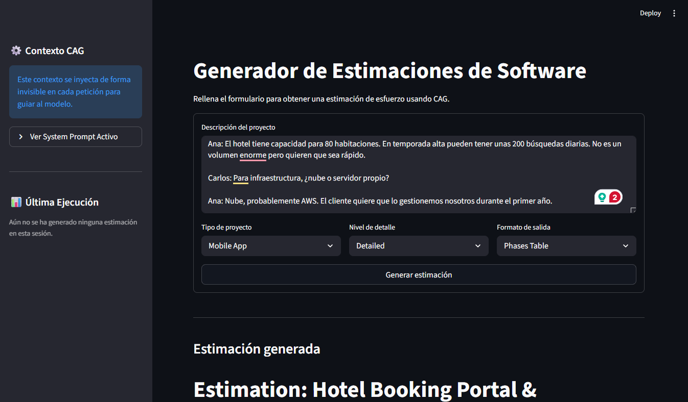

# SW Estimator

FastAPI service that generates software effort estimations using LLMs (OpenAI / Anthropic) via LiteLLM Router.  
Includes a Streamlit UI (`streamlit_app.py`) for interactive use.

---

## Requisitos

- Python 3.12+
- API key de OpenAI y/o Anthropic en un fichero `.env`:

```env
OPENAI_API_KEY=sk-...
ANTHROPIC_API_KEY=sk-ant-...
```

---

## Levantar el servicio

### Con Docker Compose (recomendado)

```bash
docker compose up --build
```

API disponible en `http://localhost:8000`.  
Docs interactivos en `http://localhost:8000/docs`.

### En local (desarrollo)

```bash
python -m venv .venv && source .venv/bin/activate
pip install -e ".[dev]"
uvicorn src.main:app --reload --port 8000
```

### Interfaz Streamlit

```bash
streamlit run streamlit_app.py
```

Abre automáticamente en `http://localhost:8501`.

---

## API

| Método | Ruta | Descripción |
|--------|------|-------------|
| `GET` | `/health` | Health check |
| `POST` | `/estimate` | Estimación completa (JSON) |
| `POST` | `/estimate/stream` | Estimación en streaming (SSE) |

### Query param `?prompt_version`

Permite seleccionar la versión del prompt Jinja2:

```
POST /estimate?prompt_version=v1   # few-shot con ejemplos (por defecto)
POST /estimate?prompt_version=v2   # zero-shot con chain-of-thought
```

Versiones disponibles: `v1`, `v2`. Patrón validado: `^v[0-9]+$`.

### Ejemplo de petición con `reference_projects`

```json
POST /estimate
{
  "description": "Portal de gestión de reservas para cadena hotelera con integración de pagos.",
  "project_type": "web",
  "detail_level": "detailed",
  "output_format": "markdown",
  "reference_projects": [
    {
      "name": "BookingLite",
      "description": "Sistema de reservas para hotel boutique",
      "total_hours": 420,
      "notes": "Sin integración de pagos"
    }
  ]
}
```

---

## Ejecutar los tests

```bash
# Todos los tests (excluye los que llaman al LLM real)
pytest tests/ --ignore=tests/prompts/test_versioning.py -q

# Suite completa (requiere API keys válidas, ~60 s)
pytest tests/ -q

# Solo tests de API
pytest tests/api/ -q

# Solo tests de prompts
pytest tests/prompts/ -q
```

### Estructura de tests

```
tests/
├── conftest.py                         # Fixture AsyncClient
├── api/
│   ├── test_estimation.py              # Endpoints /estimate
│   └── test_health.py                  # Endpoint /health
└── prompts/
    ├── test_prompt_loader.py           # render_estimation_prompt()
    ├── test_estimation_v1.py           # Templates v1 (Parte 4)
    ├── test_versioning.py              # Versionado v1/v2 + query param (Bonus 1)
    └── test_reference_projects.py      # reference_projects en schema y template (Bonus 2)
```

---

## Demo



> Interfaz Streamlit: formulario con tipo de proyecto, nivel de detalle y formato de salida.  
> El panel lateral muestra el contexto CAG inyectado y el system prompt activo.

---

## Arquitectura de prompts

Los prompts se renderizan con Jinja2 desde `src/prompts/estimation/<version>/`:

```
src/prompts/estimation/
├── v1/
│   ├── system.j2    # Few-shot con ejemplos, macros XML/Markdown
│   ├── user.j2      # <project_description> + referencia a proyectos
│   └── examples.j2  # 3 ejemplos inyectados (CAG)
└── v2/
    ├── system.j2    # Zero-shot + <chain_of_thought>
    └── user.j2      # Idéntico a v1
```

El loader (`src/prompts/loader.py`) infiere el estilo (XML vs Markdown) a partir del modelo, valida la versión e imprime un evento `prompt_rendered` vía structlog con `version`, `content_hash`, `system_chars` y `user_chars`.
