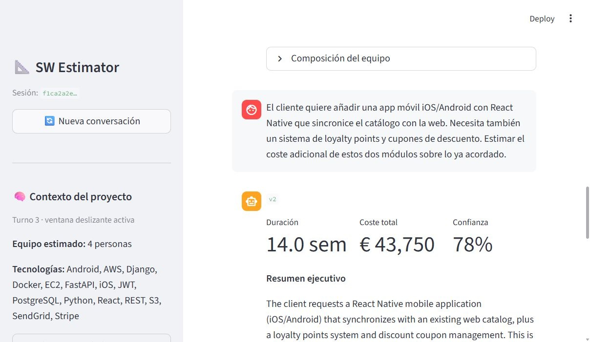

# SW Estimator

Generador de estimaciones de software a partir de transcripciones de reuniones o descripciones de proyecto. Combina un pipeline de 5 capas (guardrails, caché semántico, renderizado de prompts, LLM estructurado, guardrails de salida) con una interfaz Streamlit y una API FastAPI.

## Arquitectura

```
Streamlit (puerto 8501)
    │  HTTP
    ▼
FastAPI (puerto 8000)
    │
    ├── Layer 1 · Input guardrails (inyección, PII, moderación)
    ├── Layer 2 · Semantic cache (Redis Stack + text-embedding-3-small)
    ├── Layer 3 · Prompt rendering (Jinja2)
    ├── Layer 4 · LLM call (Instructor + LiteLLM → OpenAI / Anthropic)
    └── Layer 5 · Output guardrails + cache write
        │
        ▼
    Redis Stack (puerto 6380)
```

## Requisitos

- Python 3.13+
- [uv](https://docs.astral.sh/uv/)
- Docker Desktop (para Redis Stack)

## Configuración

Copia `.env` y rellena las claves:

```bash
# .env
LLM_PROVIDER=anthropic          # openai | anthropic

OPENAI_API_KEY=sk-...
OPENAI_MODEL=gpt-4o-mini

ANTHROPIC_API_KEY=sk-ant-...
ANTHROPIC_MODEL=claude-haiku-4-5-20251001

REDIS_URL=redis://localhost:6380         # Redis Stack local
SEMANTIC_CACHE_THRESHOLD=0.85            # similitud coseno mínima para hit
```

## Arrancar (desarrollo)

```bash
./dev.sh
```

Arranca los tres servicios en orden:

| Servicio | URL |
|---|---|
| Streamlit (frontend) | http://localhost:8501 |
| FastAPI (backend) | http://localhost:8000 |
| Redis Stack (caché) | localhost:6380 |

Los logs se guardan en `logs/api.log` y `logs/streamlit.log`.

### Arranque manual (alternativo)

Si ya tienes Redis corriendo:

```bash
# Terminal 1 — backend
uv run uvicorn src.main:app --reload

# Terminal 2 — frontend
ESTIMATOR_API_URL=http://localhost:8000 uv run streamlit run app/streamlit_app.py
```

## Parar

```bash
./dev.sh stop          # para uvicorn + streamlit + Redis Stack
```

O si arrancaste manualmente:

```bash
# Ctrl-C en cada terminal
docker compose stop redis
```

## Comandos útiles

```bash
# Ver estado de Redis
docker compose ps

# Logs en tiempo real
tail -f logs/api.log
tail -f logs/streamlit.log

# Tests
uv run pytest -v

# Documentación interactiva de la API (solo en development)
open http://localhost:8000/docs
```

## Producción (Docker Compose completo)

Requiere Docker Desktop con integración WSL activa:

```bash
docker compose up --build
```

Levanta `api` + `streamlit` + `redis` en contenedores. Streamlit se comunica con la API via red interna Docker (`http://api:8000`).

## Script `compare.py` — similitud coseno entre textos

Calcula la similitud coseno entre dos textos libres usando `text-embedding-3-small`.

**Fuera del contenedor** (requiere `.env` con `OPENAI_API_KEY`):

```bash
uv run python scripts/compare.py \
  --text-a "OAuth 2.0 authentication backend for fintech" \
  --text-b "JWT-based authorization service for banking app"
```

**Dentro del contenedor** (el servicio `api` ya tiene las variables de entorno):

```bash
docker compose exec api python scripts/compare.py \
  --text-a "OAuth 2.0 authentication backend for fintech" \
  --text-b "JWT-based authorization service for banking app"
```

Salida:

```
Text A: OAuth 2.0 authentication backend for fintech
Text B: JWT-based authorization service for banking app
Cosine similarity: 0.8421
```

## Demo



*Turno 3 de una sesión: sidebar con contexto acumulado (equipo, tecnologías, alcance) y estimación incremental del nuevo módulo móvil.*

## Sesiones y adjuntos

### Crear sesión

```bash
curl -X POST http://localhost:8000/api/v1/sessions
# → {"session_id": "7a9a9867-..."}
```

### Estimar con adjuntos (multipart/form-data)

```bash
curl -X POST http://localhost:8000/api/v1/sessions/{session_id}/estimate \
  -F "transcript=El cliente quiere una app web para gestión de proyectos" \
  -F "attachments=@requisitos.pdf" \
  -F "attachments=@contrato.docx"
```

Formatos de adjunto aceptados: `.pdf`, `.docx`. Límite: 10 MB por archivo.

### Enfoque de extracción: Camino B (extracción local)

El texto de los adjuntos se extrae **localmente en el proceso** usando
[pypdf](https://pypdf.readthedocs.io/) (PDFs) y
[python-docx](https://python-docx.readthedocs.io/) (Word), y se concatena
al transcript antes de la llamada al LLM:

```
<transcript original>

--- attachment: requisitos.pdf ---
<texto extraído del PDF>
--- end of requisitos.pdf ---
```

**Por qué Camino B y no la Files API del proveedor (Camino A):**

- **Sin lock-in de proveedor.** El texto extraído es un string ordinario que
  funciona con cualquier modelo ya conectado vía LiteLLM. La Files API difiere
  entre OpenAI y Anthropic, lo que anularía la ventaja de provider-agnostic
  del `LLMWrapper`.
- **Word (.docx) no tiene soporte nativo en ninguna Files API.** Con el Camino A
  habría que implementar extracción local de todas formas para `.docx`, acabando
  con un híbrido de los dos caminos.
- **Control de tokens.** Solo se facturan los tokens del texto que se incluye
  explícitamente; el proveedor no ve páginas irrelevantes.
- **Base para RAG.** El texto en memoria está listo para ser troceado e
  indexado en el módulo de retrieval, sin pasos adicionales.

### Project metadata — extracción heurística vs. LLM extractor

Tras cada respuesta del LLM el sistema actualiza automáticamente el `ProjectMetadata`
de la sesión (nombre del proyecto, tamaño del equipo, tecnologías, scope) para
inyectarlo en el system prompt del siguiente turno.

Se eligió **extracción heurística** sobre un segundo LLM extractor por estas razones:

- **El LLM ya devuelve datos estructurados.** `EstimationResult` contiene
  `team_composition` (de donde se extrae `assumed_team_size` directamente como suma
  de headcounts) y `executive_summary` (que se usa como `agreed_scope` sin ningún
  parsing).  No tiene sentido pagar una segunda llamada al LLM para reobtener
  información que ya está en el objeto Python.
- **Coste cero por turno.** Cada llamada a un LLM extractor costaría ~$0.001 y
  ~300 ms adicionales.  En una sesión de 10 turnos eso es 10 llamadas extra que
  no aportan información nueva.
- **La única debilidad real es la detección de tecnologías**, que depende de un
  vocabulario curado en `metadata_extractor.py`.  Ese vocabulario es trivial de
  extender y cubre la gran mayoría de stacks reales.

El módulo `src/services/metadata_extractor.py` implementa la lógica.  Si en el
futuro la precisión en detección de tecnologías fuera insuficiente, se puede
sustituir únicamente `_extract_technologies()` por una llamada LLM sin tocar el
resto del pipeline.

## Caché

| Tipo | Tecnología | Cuando aplica |
|---|---|---|
| Exacto | Dict SHA-256 en proceso | Transcripción idéntica |
| Semántico | Redis Stack + OpenAI embeddings | Transcripciones similares (similitud ≥ `SEMANTIC_CACHE_THRESHOLD`) |

El caché semántico requiere Redis Stack y `OPENAI_API_KEY` (para generar embeddings con `text-embedding-3-small`). Sin Redis, el sistema usa solo el caché exacto en memoria.

La segunda llamada con el mismo (o similar) input devuelve `cached: true` en la respuesta y se sirve en milisegundos.

## Estructura del proyecto

```
src/
├── cache/semantic.py            # Layer 2 — semantic cache (redisvl)
├── guardrails/
│   ├── input.py                 # Layer 1 — prompt injection, PII, moderation
│   └── output.py                # Layer 5 — out-of-scope enforcement
├── prompts/
│   ├── loader.py                # Layer 3 — Jinja2 render (project_metadata aware)
│   └── estimation/
│       ├── v1/                  # Templates: system.j2, user.j2, examples.j2
│       └── v2/                  # Chain-of-thought variant
├── services/
│   ├── estimation.py            # Pipeline orchestrator
│   ├── sessions.py              # ConversationHistory + ProjectMetadata + SessionStore
│   ├── metadata_extractor.py    # Heuristic metadata updater (post-turn)
│   ├── document_extractor.py    # Camino B: pypdf + python-docx local extraction
│   ├── llm_wrapper.py           # Instructor + LiteLLM
│   └── pricing.py               # Cost calculation
├── schemas/estimation.py        # Pydantic models (request / response)
├── routers/
│   ├── estimation.py            # POST /api/v1/estimate
│   └── sessions.py              # POST /sessions, POST /sessions/{id}/estimate, GET /sessions/{id}
├── dependencies.py              # FastAPI DI — wires Redis cache
└── core/
    ├── config.py                # Settings (pydantic-settings) — prompt_version, max_conversation_turns
    └── exceptions.py            # HTTP error handlers
app/
└── streamlit_app.py             # Streamlit multi-turn client
tests/
└── api/test_sessions.py         # Integration tests: metadata accumulation, PDF attachment, sliding window
dev.sh                           # Script de arranque local
docker-compose.yml               # Redis Stack + API + Streamlit
```
