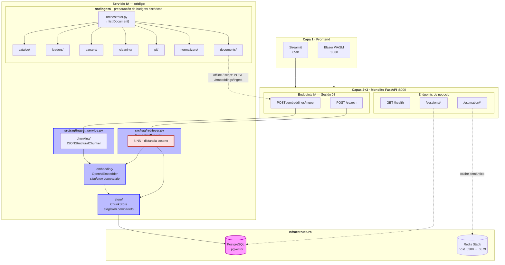
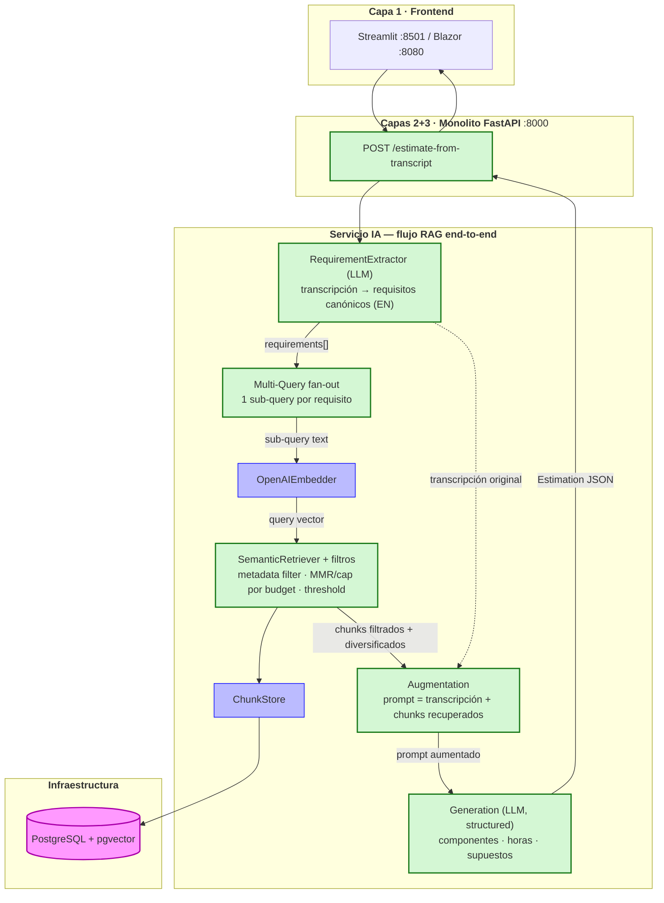

# Diagnóstico arquitectónico — Sesión 09 (pre-work)

> Plantilla del entregable. Rellena las cuatro secciones obligatorias y guarda el resultado como
> `arquitectura-actual.md` en la raíz del repositorio. Tus observaciones van en español; los
> comandos, payloads y nombres de campo van en inglés.

---

## 1. Diagrama de la arquitectura actual

> Las tres capas (frontend, backend de negocio, servicio IA) con los módulos del servicio IA que
> existen al cierre de Sesión 08. Baja un nivel en el servicio IA y marca **dónde acaba** lo
> implementado. No dibujes lo que falta — eso es la sección 4.

> **Nota de honestidad arquitectónica:** las tres capas del enunciado no son tres procesos. El
> "backend de negocio" y el "servicio IA" viven en **el mismo monolito FastAPI** (`:8000`,
> [src/main.py](src/main.py)); el servicio IA es un conjunto de paquetes (`src/rag/`, `src/ingest/`),
> no un microservicio aparte. Los nombres genéricos del enunciado mapean así sobre el repo real:
> `ingest/` → [src/rag/ingest_service.py](src/rag/ingest_service.py) (+ `src/ingest/` para la
> preparación previa), `embedding_pipeline/` → [src/rag/embedding/](src/rag/embedding/),
> `storage/` → [src/rag/store/](src/rag/store/).



> **Convenciones del diagrama:**
> - `─→` flujo normal de datos · `-.→` dependencia débil / acceso indirecto
> - Borde azul = código RAG implementado al cierre de Sesión 08
> - Caja roja (`SemanticRetriever`) = **donde se detiene el flujo hoy**: devuelve top-k chunks con
>   sus distancias, pero nadie los lee, reordena ni los pasa a un LLM. No hay Augmentation ni
>   Generation. Ahí está el hueco que abre la Sesión 09.
> - `OpenAIEmbedder` y `ChunkStore` se dibujan **una sola vez**: son singletons `@lru_cache`
>   ([src/dependencies.py](src/dependencies.py#L44-L63)) inyectados tanto en escritura como en lectura.

**Flujo de datos hoy:**

1. **Preparación histórica (`src/ingest/`):** `orchestrator.py` valida la fuente contra `catalog/`,
   carga con `loaders/`, parsea con `parsers/`, limpia con `cleaning/`, pseudonimiza con `pii/`,
   normaliza con `normalizers/` y emite `list[Document]`. **No llama al RAG directamente.**
2. **Escritura RAG (`POST /embeddings/ingest`):** alimentado offline/por script con los budgets ya
   preparados → `RagIngestService` (chunking → embed → persist en **una transacción**) → `ChunkStore`
   → PostgreSQL/pgvector.
3. **Lectura RAG (`POST /search`):** `SemanticRetriever` embebe la query con el **mismo** modelo del
   ingest, rankea por distancia coseno vía SQL y devuelve top-k chunks. **Fin del recorrido.**

---

## 2. Trace anotado de `02_ambiguous.txt`

> Trace manual a través del sistema tal como está. Para cada paso: la llamada ejecutada, la
> respuesta cruda y un comentario de una o dos frases.

**Entorno del trace (reproducible):**

```bash
docker compose up -d postgres                 # pgvector :5432
uv run alembic upgrade head                   # crea documents + chunks
# Sembrar el corpus una vez (17 budgets → 60 chunks). Idempotente (409 = ya presente):
ESTIMATOR_BASE_URL=http://127.0.0.1:8010 uv run python scripts/query_examples.py
# API de ESTE repo en :8010 (el :8000 lo ocupa otro proyecto):
uv run uvicorn src.main:app --host 127.0.0.1 --port 8010
```

Estado de la BD al hacer el trace: `documents = 17`, `chunks = 60`.

### Paso 1 — Embeber la transcripción completa

El servicio S08 **no expone un endpoint HTTP para embeber texto libre** (solo
`POST /embeddings/ingest`, que ingiere un `Budget`, y `POST /search`, que embebe internamente). Así
que se invoca el **módulo** de embeddings tal cual lo usa el search path:

```python
# scripts/trace_02_ambiguous.py (fragmento)
from src.dependencies import get_embedder
text = open("examples/transcripts/02_ambiguous.txt", encoding="utf-8").read()
vector = get_embedder().embed_one(text)        # text-embedding-3-small
```

```
transcript_chars : 2853
model            : text-embedding-3-small
dimensions       : 1536
L2_norm          : 1.000078
first_component  : 0.007069
last_component   : 0.020050
```

**Comentario:** el vector es unitario (norma L2 ≈ 1.0 → cosine distance = 1 − dot), de 1536 dims.
Representa **un único punto "promedio"** de TODA la transcripción: mete en la misma bolsa lo
relevante (vender online, pago con tarjeta, panel de control, fidelización, email de confirmación) y
todo el ruido conversacional (la tienda del padre desde el 92, la mujer, el primo en Francia, el
cuaderno). Comprimir 2.853 caracteres ambiguos en un solo vector **diluye** las señales concretas.

### Paso 2 — Búsqueda semántica (top-5)

Se pasa la transcripción completa como `query` al endpoint (S08 embebe la query internamente con el
mismo modelo del ingest). Equivalente en `curl`:

```bash
curl -s http://127.0.0.1:8010/search \
  -H 'Content-Type: application/json' \
  --data "$(jq -Rs '{query: ., k: 5}' examples/transcripts/02_ambiguous.txt)" | jq
```

Respuesta cruda (`query` recortada; `content` colapsado a una línea):

```json
{
  "k": 5,
  "search_time_ms": 245,
  "results": [
    { "chunk_id": 16, "document_id": 5, "distance": 0.6104,
      "content": "[Project: Headless e-commerce storefront with personalized recommendations] [Client sector: ecommerce | Year: 2024 | Main tech: node] Component: Product catalog API — GraphQL catalog API with faceted search, inventory availability and multi-currency pricing backed by Elasticsearch. Tech: node, graphql, elasticsearch. Complexity: medium. Hours: 150",
      "metadata": { "budget_id": "BUD-2024-005", "client_sector": "ecommerce", "component_id": "CATALOG-001", "complexity": "medium", "estimated_hours": 150 } },
    { "chunk_id": 17, "document_id": 5, "distance": 0.6158,
      "content": "[Project: Headless e-commerce storefront ...] Component: Cart and checkout service — Stateless cart service with promotion engine, tax calculation and a checkout orchestration that integrates the payment provider. Tech: node, redis, postgresql. Complexity: high. Hours: 140",
      "metadata": { "budget_id": "BUD-2024-005", "client_sector": "ecommerce", "component_id": "CART-002", "complexity": "high", "estimated_hours": 140 } },
    { "chunk_id": 18, "document_id": 5, "distance": 0.6396,
      "content": "[Project: Headless e-commerce storefront ...] Component: Personalized recommendations — Collaborative-filtering recommendations served from a feature store and exposed as a low-latency API. Tech: node, redis. Complexity: medium. Hours: 110",
      "metadata": { "budget_id": "BUD-2024-005", "client_sector": "ecommerce", "component_id": "RECO-003", "complexity": "medium", "estimated_hours": 110 } },
    { "chunk_id": 19, "document_id": 5, "distance": 0.6404,
      "content": "[Project: Headless e-commerce storefront ...] Component: Storefront PWA — Progressive web app storefront consuming the headless APIs with server-side rendering for SEO. Tech: next_js, react. Complexity: low. Hours: 60",
      "metadata": { "budget_id": "BUD-2024-005", "client_sector": "ecommerce", "component_id": "STORE-004", "complexity": "low", "estimated_hours": 60 } },
    { "chunk_id": 27, "document_id": 8, "distance": 0.6432,
      "content": "[Project: Fashion returns management and resale portal] [Client sector: ecommerce | Year: 2023 | Main tech: dotnet] Component: Returns portal — Self-service returns portal with label generation, reason capture and automatic restock or resale routing. Tech: dotnet, sqlserver. Complexity: medium. Hours: 140",
      "metadata": { "budget_id": "BUD-2024-008", "client_sector": "ecommerce", "component_id": "RET-001", "complexity": "medium", "estimated_hours": 140 } }
  ]
}
```

**Comentario:** el acierto grueso es que los 5 resultados caen en **sector ecommerce** sin que el
cliente diga nunca "ecommerce" — la inferencia semántica funciona. El problema es la **calidad fina**:
distancias 0.61–0.64 (similitud coseno ~0.36–0.39, baja) y **4 de 5 chunks vienen del mismo budget**
`BUD-2024-005`; hay poca diversidad y ningún chunk de fidelización, panel de control ni email.

### Paso 3 — Lectura de los chunks devueltos

| # | chunk_id | budget_id | Sector | Componente | ¿Relevante para lo que pide Rubén? |
|---|----------|-----------|--------|------------|-------------------------------------|
| 1 | 16 | BUD-2024-005 | ecommerce | Product catalog API | **Parcial.** El cliente quiere "vender por internet / ver productos", así que un catálogo encaja; pero GraphQL + Elasticsearch + multi-currency es muy pesado para una tienda gourmet pequeña. |
| 2 | 17 | BUD-2024-005 | ecommerce | Cart & checkout service | **Sí, el mejor.** Rubén insiste en "pagar con tarjeta, fácil y seguro" y en el abandono de carrito; este componente integra el payment provider. Match directo. |
| 3 | 18 | BUD-2024-005 | ecommerce | Personalized recommendations | **No.** El cliente pidió **fidelización/puntos/club**, no recomendaciones por collaborative-filtering. El embedding las confunde por cercanía temática, pero son cosas distintas. |
| 4 | 19 | BUD-2024-005 | ecommerce | Storefront PWA | **Sí, razonable.** El escaparate donde "la gente entre, vea los productos y compre" es justo una storefront web. |
| 5 | 27 | BUD-2024-008 | ecommerce | Returns & resale portal | **No.** Rubén nunca mencionó devoluciones ni reventa; aparece solo por ser ecommerce. Ruido. |

**Honestidad sobre el resultado:** el retrieval acierta el *vecindario* (ecommerce + checkout) pero
**falla en cobertura**: de las 5 necesidades reales del cliente —tienda online, **pago con tarjeta**,
**panel de control con métricas/stock**, **programa de fidelización**, **email de confirmación de
pedido**— solo recupera bien el pago y, a medias, el catálogo/escaparate. Las otras tres no aparecen,
y en su lugar entran dos componentes que el cliente no pidió (recomendaciones, devoluciones). Con esto
no se puede construir todavía una estimación fundamentada: faltaría que alguien **leyera** estos
chunks, descartara el ruido y razonara sobre los gaps — exactamente lo que no existe en S08.

---

## 3. Diagnóstico: cinco fallos identificados

> Cinco fallos concretos y verificables que impiden hoy convertir la transcripción en una
> estimación de calidad. Para cada uno: Problema observado / Causa probable / Propuesta de solución.

### Fallo 1 — Asimetría de granularidad: transcripción-de-todo vs chunk-de-componente
- **Problema observado:** se embebe la transcripción entera (2.853 chars / ~700 tokens, un solo vector) y se compara contra chunks de ~50–60 tokens. En el trace las 5 distancias caen apretadas en **0.6104–0.6432** (rango de solo 0.033; similitud ~0.36–0.39, baja para todas). No hay un "claramente mejor": el top-1 y el top-5 son casi indistinguibles.
- **Causa probable:** un vector único promedia señal + ruido de toda la reunión (la tienda del padre, el primo en Francia, el cuaderno, las muletillas) y lo proyecta a un punto "tibio" equidistante de muchos chunks. El query y el corpus viven a escalas distintas, así que el coseno se comprime.
- **Propuesta de solución:** una etapa de **extracción de requisitos** antes del retrieval que convierta la transcripción en consultas cortas y limpias (una por necesidad), del mismo tamaño y registro que los chunks.

### Fallo 2 — Sin extracción/normalización de la query: entra ruido conversacional y en otro idioma
- **Problema observado:** la query es la transcripción cruda en español coloquial, con timestamps (`[00:00:08]`), muletillas (`¿eh?`) y digresiones; el corpus son chunks en inglés estructurado (`[Project: ...] Component: ... Tech stack: ...`). El cliente nunca dice "ecommerce" ni "checkout" y aun así acierta el sector, pero a costa de distancias altas (~0.61).
- **Causa probable:** no existe ninguna etapa entre la transcripción y el embedder; `embed_one(text)` recibe el texto verbatim. El desajuste de idioma (ES↔EN) y de registro (charla↔ficha técnica) penaliza la similitud, aunque el modelo sea multilingüe.
- **Propuesta de solución:** un paso de **comprensión/normalización** (un LLM que resuma la transcripción en requisitos canónicos, en inglés y con vocabulario técnico) que produzca el texto que realmente se embebe.

### Fallo 3 — Recall por necesidad: el cliente pide ~5 cosas y solo se recuperan 1–2
- **Problema observado:** Rubén enuncia cinco necesidades —tienda online, **pago con tarjeta**, **panel de control con métricas/stock**, **programa de fidelización**, **email de confirmación**—. El top-5 cubre bien el pago (chunk 17) y a medias el catálogo/escaparate (16, 19), pero **no devuelve ningún chunk de fidelización, dashboard ni email**, y mete dos que el cliente no pidió (recomendaciones, portal de devoluciones).
- **Causa probable:** una sola query → un solo vector → una sola región del espacio. Una transcripción multi-necesidad no se puede representar con un punto; las necesidades minoritarias quedan fuera del top-k por mucho que k crezca.
- **Propuesta de solución:** **descomponer la query en sub-consultas** (multi-query / fan-out por requisito extraído) y unir/deduplicar los resultados, de modo que cada necesidad recupere sus propios chunks.

### Fallo 4 — Retrieval sin filtrado ni diversificación: 4 de 5 chunks del mismo budget
- **Problema observado:** **4 de los 5** resultados vienen de `BUD-2024-005` (catalog/cart/reco/store del mismo proyecto). El quinto (`BUD-2024-008`, devoluciones) entra solo por ser ecommerce. La diversidad de presupuestos analogables es casi nula.
- **Causa probable:** `SemanticRetriever.search` hace k-NN puro por `cosine_distance` en SQL, **sin filtro por metadata ni diversificación** (MMR / cap por `budget_id`), pese a que el store ya guarda `client_sector`, `complexity`, `budget_id` con índice GIN. El proyecto más "dominante" en el embedding acapara el top-k.
- **Propuesta de solución:** añadir **filtrado por metadata** (p. ej. `sector = ecommerce`) y **diversificación** (limitar nº de chunks por budget o aplicar MMR) sobre el ranking actual.

### Fallo 5 — El flujo termina en retrieval: no hay Augmentation ni Generation
- **Problema observado:** `POST /search` devuelve los chunks y **se detiene ahí** (la caja roja de la sección 1). Nadie lee esos chunks, descarta el ruido (recomendaciones, devoluciones), razona sobre los gaps ni produce una estimación con horas y justificación. La salida del sistema es una lista de fragmentos, no una estimación.
- **Causa probable:** no existe ninguna pieza aguas abajo del retriever; `SearchResponse` no se consume en ningún sitio. Falta literalmente la mitad del bucle RAG (la A y la G de Query→Retrieval→**Augmentation→Generation**).
- **Propuesta de solución:** una etapa de **augmentation + generation**: montar un prompt con la transcripción + los chunks recuperados y pedir a un LLM una estimación estructurada (componentes, horas, supuestos) fundamentada en los presupuestos históricos.

### Otros

- **Sin umbral de corte (threshold):** el chunk 27 (devoluciones, irrelevante) se devuelve igual que el resto a distancia 0.6432; no hay un corte que diga "esto está demasiado lejos, descártalo". Un threshold sobre la distancia filtraría el ruido del top-k.
- **Granularidad de chunk sin ancla de proyecto:** los 60 chunks son todos `chunk_type = "budget_component"`; no hay un chunk a nivel de proyecto con `total_estimated_hours`. Para estimar un proyecto completo por analogía haría falta poder recuperar el agregado, no solo componentes sueltos.

---

## 4. Propuesta de evolución arquitectónica

> Segundo diagrama de la misma arquitectura de tres capas, con las cajas/módulos que añadirías para
> cerrar el flujo transcripción → estimación generada. Marca claramente lo NUEVO respecto a la
> sección 1.



> **Convenciones:** caja **verde** = nueva respecto a la sección 1 · caja **azul** = pieza de S08
> reutilizada sin cambios (`OpenAIEmbedder`, `ChunkStore`, pgvector). `SemanticRetriever` se pinta
> verde porque, aunque el k-NN base ya existe, los **filtros + diversificación + threshold** son nuevos.

**Responsabilidad y flujo.** El `RequirementExtractor` (LLM) convierte la transcripción cruda en una
lista de **requisitos canónicos en inglés** (tienda online, pago con tarjeta, panel, fidelización,
email), eliminando ruido e idioma; ese `requirements[]` alimenta el **Multi-Query fan-out**, que
lanza una sub-query por requisito. Cada sub-query se embebe con el `OpenAIEmbedder` reutilizado y pasa
al `SemanticRetriever + filtros`, que ahora **filtra por metadata, diversifica por budget y corta por
threshold**; los chunks recuperados (ya limpios y variados) fluyen a la **Augmentation**, que monta un
prompt con la transcripción original + esos chunks, y de ahí a la **Generation**, un LLM con salida
estructurada que devuelve la **estimación** (componentes, horas, supuestos) al endpoint y al frontend.

**Pieza más crítica.** El `RequirementExtractor`. Es la raíz de los fallos 1–3 del trace (vector
único, ruido, idioma, recall por necesidad) y todo lo que viene después hereda la calidad de su
salida: con requisitos limpios y separados, el retrieval actual ya mejora mucho sin tocarlo; sin
ellos, una Generation sobre los chunks ruidosos de hoy solo produciría una estimación segura y
equivocada. Atacaría esa pieza primero.